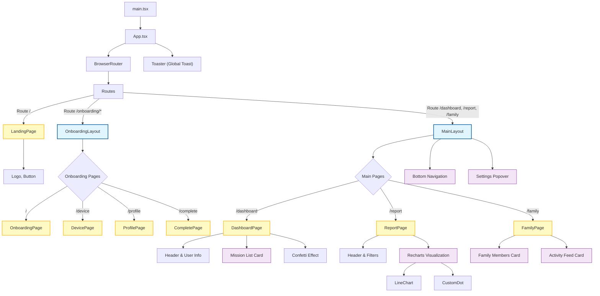

# 컴포넌트 구조 분석

## 목차
1. [컴포넌트 트리 (Mermaid)](#컴포넌트-트리)
2. [아키텍처 개요](#아키텍처-개요)
3. [컴포넌트 분류](#컴포넌트-분류)
4. [효율성 평가](#효율성-평가)
5. [개선 가능성](#개선-가능성)

---

## 컴포넌트 트리



---

## 아키텍처 개요

### 1. 레이어 구조

이 프로젝트는 **Next.js의 App Router 파일 구조**를 차용하면서도 **Vite(SPA)** 환경에서 동작하는 독특한 하이브리드 구조를 채택하고 있습니다.

```
📦 src/
├─ 📱 app/                 # 페이지 및 라우팅 레이어 (Feature 중심)
│  ├─ (main)/              # 대시보드 등 메인 앱 영역
│  │  ├─ dashboard/
│  │  ├─ family/
│  │  └─ report/
│  ├─ onboarding/          # 온보딩 프로세스 영역
│  └─ layout.tsx           # 공통 레이아웃
│
├─ 🎨 components/          # 컴포넌트 레이어
│  ├─ ui/                  # Atomic Design의 Atoms/Molecules (shadcn/ui)
│  ├─ common/              # 범용 컴포넌트 (Header, ListItem 등)
│  ├─ layout/              # 구조적 컴포넌트
│  └─ icons/               # 아이콘 에셋
│
├─ 🧠 ai/                  # AI 로직 레이어
│  ├─ dev.ts               # Genkit 개발 설정
│  └─ genkit.ts            # Genkit 설정
│
├─ 🔧 lib/                 # 유틸리티 레이어
│  ├─ utils.ts             # Tailwind merge 등 헬퍼
│  └─ mockData.ts          # 목업 데이터
│
└─ ⚓ hooks/                # 커스텀 훅 레이어
```

### 2. 데이터 흐름

```
[User Interaction] 
       ↓
[Page Component (src/app/**/page.tsx)]
       ↓
[Custom Hooks / Zustand Store] (상태 업데이트)
       ↓
[API / Genkit AI Service] (비동기 요청)
       ↓
[UI Components (src/components/ui/**)] (렌더링)
```

---

## 컴포넌트 분류

### A. Primitives (shadcn/ui)
프로젝트의 가장 강력한 자산은 `components/ui`에 구축된 디자인 시스템입니다.

| 컴포넌트 | 역할 | 의존성 |
|---------|------|-------|
| `Card` | 컨텐츠 컨테이너 | Radix UI, Tailwind |
| `Button` | 액션 트리거 | Radix Slot |
| `Form` | 입력 폼 래퍼 | React Hook Form, Zod |
| `Chart` | 데이터 시각화 | Recharts |
| `Toast` | 알림 | Radix Toast |

### B. Feature Pages
비즈니스 로직이 집중된 페이지 컴포넌트들입니다.

| 페이지 | 경로 | 주요 기능 |
|-------|------|----------|
| `Dashboard` | `/dashboard` | 미션 확인, 사용자 상태 요약 |
| `Report` | `/report` | 건강 데이터 시각화 (Recharts) |
| `Onboarding` | `/onboarding/*` | 사용자 프로필 및 디바이스 설정 (Wizard 패턴) |

---

## 효율성 평가

### ✅ 장점

1.  **표준화된 UI 시스템**
    *   `class-variance-authority (cva)`를 사용하여 스타일 변형(variant) 관리가 체계적입니다.
    *   Tailwind CSS와의 결합으로 스타일 오버라이딩이 매우 쉽습니다.

2.  **명확한 관심사 분리**
    *   `ui/` 폴더는 순수 스타일/인터랙션만 담당하고, 비즈니스 로직은 `app/` 폴더에 격리되어 있습니다.
    *   `lib/utils.ts`를 통해 공통 로직을 중앙화했습니다.

3.  **유연한 라우팅 구조**
    *   폴더 구조 자체가 라우팅을 암시하도록 구성되어 있어(Next.js 스타일), 개발자가 파일 위치만 보고도 URL 구조를 예측할 수 있습니다.

### ⚠️ 개선 필요 영역

1.  **페이지 컴포넌트의 비대화**
    *   `dashboard/page.tsx`나 `report/page.tsx`에 데이터 페칭, 가공, 렌더링 로직이 혼재될 가능성이 높습니다.
    *   -> *Container-Presenter 패턴*이나 *Custom Hook*으로 로직 분리가 필요합니다.

2.  **AI 로직의 결합도**
    *   UI 컴포넌트 내에서 AI 함수를 직접 호출하는 경우, 테스트가 어려워질 수 있습니다.
    *   -> AI 서비스 레이어를 별도로 두어 추상화하는 것이 좋습니다.

---

## 개선 가능성

### 🎯 단기 개선 (Refactoring)

#### 1. 컴포넌트 분할
`DashboardPage` 내의 미션 리스트나 `ReportPage`의 차트 섹션을 별도 컴포넌트로 분리하여 가독성을 높입니다.

```typescript
// Before: src/app/dashboard/page.tsx
return (
  <div>
    {/* 100줄 이상의 미션 리스트 렌더링 코드 */}
  </div>
)

// After: src/app/dashboard/components/MissionList.tsx
return (
  <div>
    <MissionList missions={data} />
  </div>
)
```

#### 2. AI Service 추상화
AI 호출을 위한 전용 Hook을 만듭니다.

```typescript
// hooks/useAiCoach.ts
export const useAiCoach = () => {
  const generateAdvice = async (data: HealthData) => {
    // Genkit 호출 로직
  };
  return { generateAdvice };
};
```

### 🚀 장기 개선 (Architecture)

1.  **FSD (Feature-Sliced Design) 고려**
    *   현재 구조도 훌륭하지만, 프로젝트가 커지면 `features/` 폴더를 도입하여 기능 단위로 응집도를 높이는 것을 고려해볼 수 있습니다.

2.  **상태 관리 고도화**
    *   현재 전역 상태 관리 도구가 명시적으로 보이지 않으나(Context API 추정), 복잡도가 증가하면 `Zustand`나 `Jotai` 도입을 고려합니다.

---

## 결론

**AS-Digt-HC-Dev-FE**의 컴포넌트 구조는 **확장성**과 **유지보수성** 측면에서 매우 우수하게 설계되었습니다. 특히 shadcn/ui를 활용한 `ui` 컴포넌트 레이어는 프로덕션 레벨의 품질을 보여줍니다. 라우트별 비즈니스 로직 분리만 지속적으로 관리한다면 훌륭한 프로젝트가 될 것입니다.

