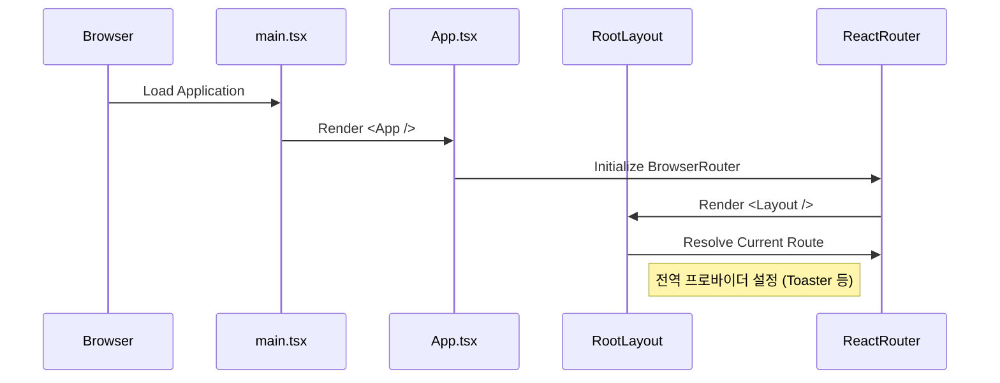
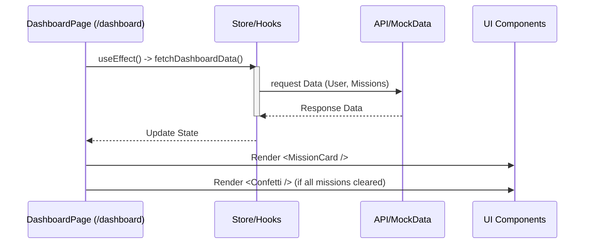
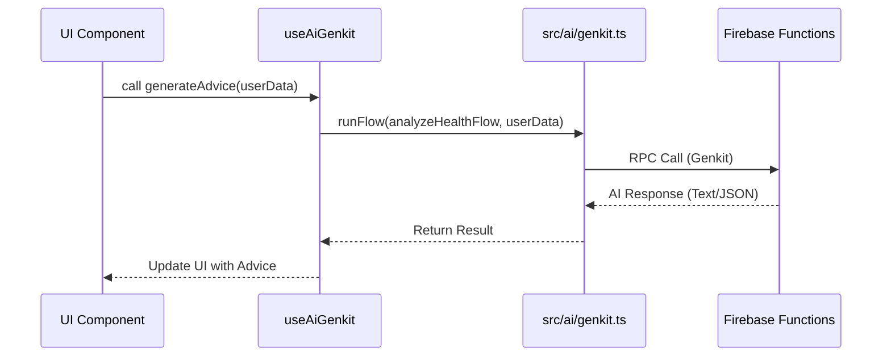

# 함수 호출 구조 (Function Call Hierarchy)

## 개요
본 문서는 **AS-Digt-HC-Dev-FE** 애플리케이션의 주요 실행 흐름과 데이터 전달 과정을 시각화합니다. 
주로 라우팅 진입부터 데이터 페칭, UI 렌더링까지의 흐름을 다룹니다.

---

## 1. 전체 애플리케이션 초기화 흐름

애플리케이션이 시작될 때의 호출 구조입니다.



---

## 2. 온보딩 프로세스 (Onboarding Flow)

사용자가 처음 앱에 진입하여 프로필과 기기를 설정하는 과정입니다.

```
[Entry: /onboarding]
    ↓
1. OnboardingLayout (src/app/onboarding/layout.tsx)
    │
    ├─ Render <Outlet /> (현재 단계 페이지 표시)
    │
    └─ <ProgressBar /> (진행 상황 표시)

[Page: /onboarding/profile]
    ↓
User Input (Name, Age) → React Hook Form (zod validation)
    ↓
Submit → LocalStorage / Store Update (Profile Data)
    ↓
Navigate to /onboarding/device
```

---

## 3. 대시보드 데이터 흐름 (Dashboard Flow)

메인 대시보드에서 데이터를 불러오고 표시하는 구조입니다.



---

## 4. 리포트 및 차트 렌더링 (Report Flow)

건강 리포트 페이지에서 데이터가 시각화되는 과정입니다.

```
[Page: src/app/report/page.tsx]
    │
    ├── 1. Data Preparation
    │      (MockData 가져오기 or API 호출)
    │      ↓
    ├── 2. Data Processing
    │      (Recharts 형식에 맞게 데이터 가공)
    │      ↓
    └── 3. Rendering
           ├── <PageHeader />
           ├── <Card>
           │    └── <ChartContainer>
           │          └── <LineChart> (Recharts)
           │                ├── <CartesianGrid />
           │                ├── <XAxis /> / <YAxis />
           │                └── <Tooltip />
           └── <AnalysisText> (AI generated insight)
```

---

## 5. AI Genkit 호출 구조 (AI Integration)

AI 기능을 통해 조언을 생성하는 흐름입니다.



---

## 6. 파일 간 참조 관계 요약

*   **`src/main.tsx`**
    *   Imports: `App.tsx`, `globals.css`
*   **`src/App.tsx`**
    *   Imports: `react-router-dom`, `pages/**`, `components/ui/toaster`
*   **`src/app/dashboard/page.tsx`**
    *   Imports: `components/common/PageHeader`, `components/ui/card`, `lib/mockData`
*   **`src/components/ui/*`**
    *   Imports: `@radix-ui/*`, `lib/utils (cn)`

이 계층 구조를 이해하면 디버깅 시 데이터가 어디서 끊겼는지, 혹은 스타일이 어디서 상속되는지 추적하기 쉽습니다.

